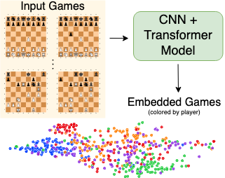

#  Detecting Individual Decision-Making Style: Exploring Behavioral Stylometry in Chess

  

## Code

Due to the sensitive nature of our model the code is not available for direct download. Please contact the corresponding author ([Reid McIlroy-Young](https://reidmcy.com)) for access to the code. 

Contact information can be found in the [paper](https://openreview.net/forum?id=9RFFgpQAOzk), on Reid's [website](https://reidmcy.com) or you can contact Reid on [Twitter](https://twitter.com/reidmcy).

## Poster

